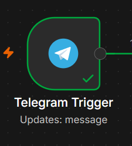
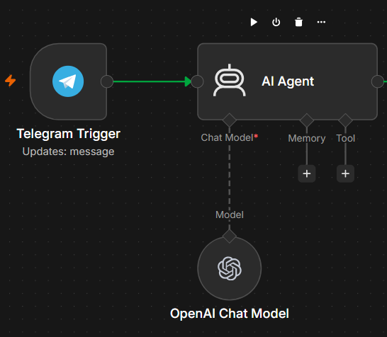
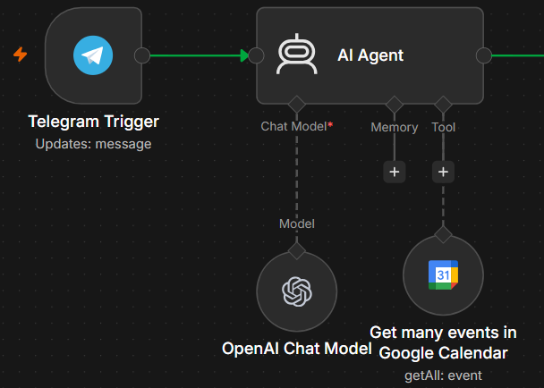
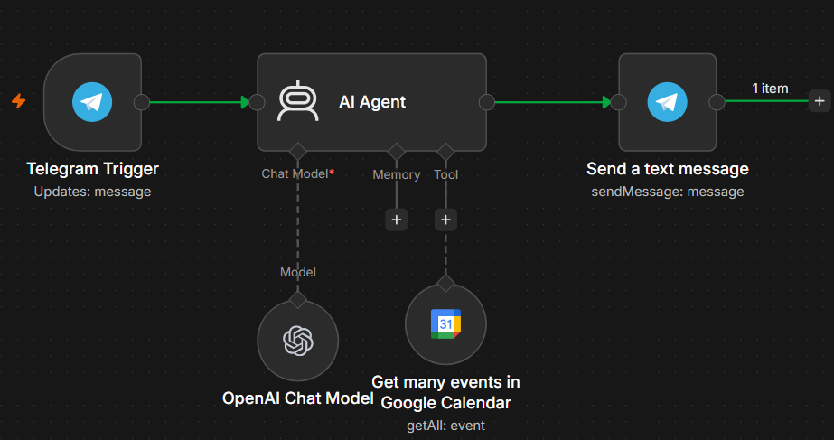
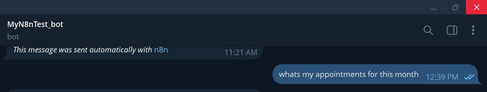
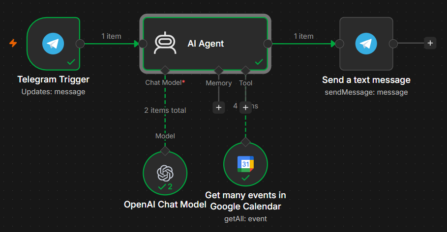
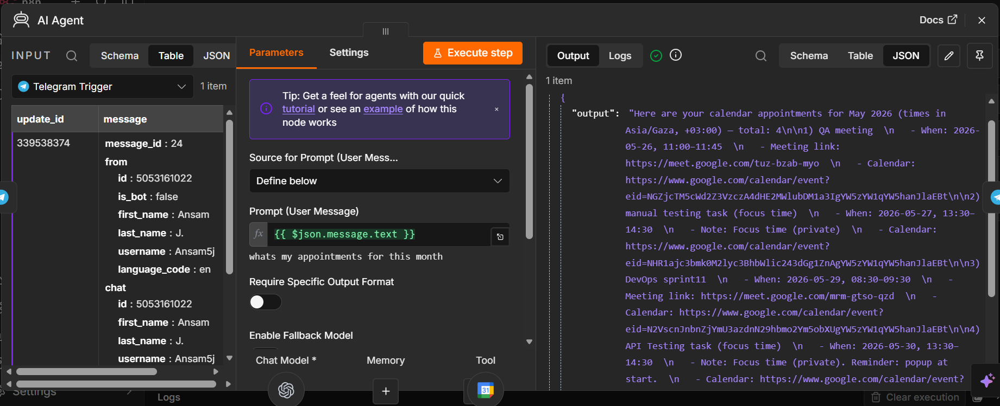
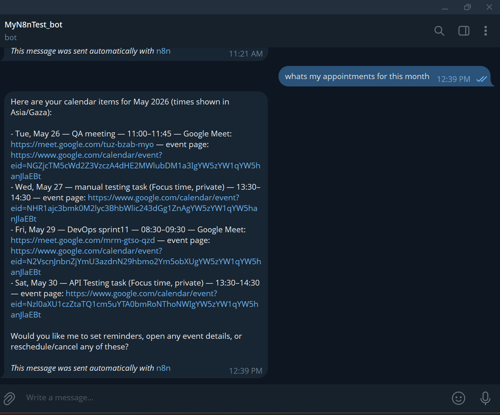

# automated-workflows-n8n

## **[AI-Powered Calendar Assistant via Telegram](./telegram-google-calendar-agent)**

A step-by-step documentation of building an autonomous AI Assistant using n8n that connects Telegram to Google Calendar. This assistant uses an AI Agent to understand natural language, check your calendar, and send your schedule back to you on Telegram.

### Step-by-Step Implementation

#### Step 1: Setting up the Telegram Trigger
The entry point of the workflow is to listen for any new message sent to the Telegram bot.

* **How it was built:** The bot was created using Telegram's `@BotFather` to get a secure API Token.
* **Node Configuration:** A `Telegram Trigger` node was added to n8n and configured with the bot credentials to listen for the `message` event.
  

#### Step 2: Configuring the AI Agent Engine
The core reasoning engine of this project is the AI Agent node, which decides how to handle the user's request.

* **How it was built:**
  * Connected an LLM Chat Model (like OpenAI Chat Model) to the AI Agent node.
* **Input Mapping:** Inside the `Prompt` field, the user's dynamic message text was linked directly from the trigger using: `{{ $json.message.text }}`.
  

#### Step 3: Linking the Google Calendar Tool
To allow the AI Agent to actually see your real-world appointments, it needs a specific tool attached to it.

* **How it was built:** A `Google Calendar` node was dragged and connected directly to the bottom of the AI Agent as a **Tool**.
* **Node Configuration:**
  * **Resource:** `Event`
  * **Operation:** `Get Many`
  * **Calendar ID:** Linked to your primary email address (`ansamjanajreh@gmail.com`).
  * **Tool Description:** Changed to *Set Manually* with a clear description so the AI knows exactly when to call it: *"Use this tool to fetch, retrieve, or list the user's calendar events from Google Calendar."*
    

#### Step 4: Routing the Final Response via Telegram
Once the AI Agent calls the calendar and fetches the data, the final step is to send that formulated answer back to your chat.

* **How it was built:** A regular Telegram node (`Send a text message` operation) was placed at the very end of the workflow.
* **Node Configuration:**
  * **Chat ID:** Mapped dynamically using expressions to match your personal chat ID: `{{ $('Telegram Trigger').item.json.message.chat.id }}`.
  * **Text:** Mapped to output the AI's final response: `{{ $json.output }}`.
    

---

### Live Testing & Results

#### 1. Sending the First Query
Testing began by activating the workflow using **Execute workflow** and sending a natural language prompt via Telegram:

> *"whats my appointments for this month ?"*

#### 2. Successful Workflow Execution
The entire canvas successfully executed in real-time. Every single node turned green, indicating perfect data routing, successful API handshakes, and proper execution loops.

#### 3. Data Payload Inspection (Behind the Scenes)
Before the AI Agent formats the response, we can inspect the raw data payload returned from the Google Calendar API inside n8n. This confirms that the system is successfully fetching and parsing structured JSON data directly from the server.

#### 4. Final AI Response Received
The AI successfully called the calendar, processed the structural events data, and returned a cleanly formatted summary directly to the chat interface.

### Live Demo
You can test this AI-powered scheduling assistant live by sending a natural language query directly to the active Telegram bot link below:

  **[Chat with the Live Calendar Assistant Bot](https://ansam65.app.n8n.cloud/webhook/bb5ae2fe-52c7-4736-b518-0a4eb41434a5/webhook)**

---

## **[Automated E-commerce Order Processing System](./Automated%20E-commerce%20Order%20Processing%20System)**

An end-to-end automated pipeline built with **n8n** to streamline e-commerce order workflows. This system listens for customer form submissions, standardizes raw data fields using custom **JavaScript**, implements selective business routing thresholds, triggers dynamic email responses via **Gmail**, and logs all activities inside a secure database backend via **Google Sheets**.

### Step-by-Step Implementation

#### Step 1: Customer Order Ingress (Form Submission)
The workflow kicks off the moment a transaction entry or client checkout profile arrives at our primary webhook listener.

* **The Process:** The consumer fills out an order checkout interface capturing key fields: *Full Name*, *Email Address*, *Phone Number*, *Country*, and the total *Order Total*.

  
  &nbsp;&nbsp;&nbsp;&nbsp;
  

#### Step 2: Data Standardization via JavaScript
To normalize inconsistent data inputs (such as mixed casing, leading whitespaces, or missing keys) before database write operations, a custom script engine is injected.
* **The Execution:** Using a dedicated **Code Node** loaded with a script layout, the workflow cleans client email records, parses numeric values safely, and exports structured variables.
  
 

 #### Step 3: Dynamic Field Mapping
Following data cleanup operations, the structured object parameters must be explicitly instantiated into the localized operational context.
* **The Process:** An **Edit Fields** configuration maps variables cleanly (e.g., parsing raw `firstName` or formatting time metadata into a standardized `submittedAt` timestamp string).
  

#### Step 4: Business Logic & Threshold Filtering
To create differential client journeys, we execute an automated split router based on active spending targets.
* **The Rule:** An **If Node** evaluates incoming values to check if `{{ $json.orderTotal }}` is **greater than or equal to 100**.
* **The Split Path:** * **True Branch:** Routes orders $\ge 100$ to premium communication pathways.
  * **False Branch:** Routes low-threshold orders through standard operational processing.
    

### Live Demo
You can test this automated pipeline live by submitting a mock order through the production form link below:

  **[Try the Live E-commerce Order Form](https://ansam65.app.n8n.cloud/form/d73ae766-abc0-477f-bf31-3b972c78db4c)**
